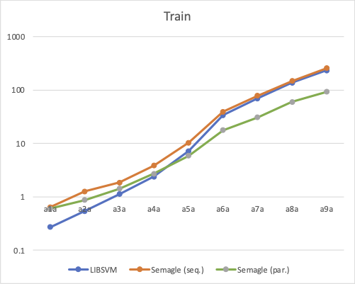
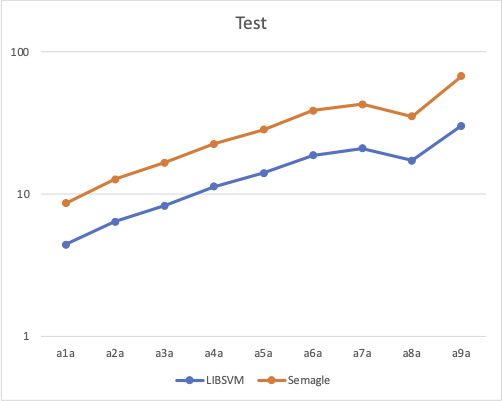
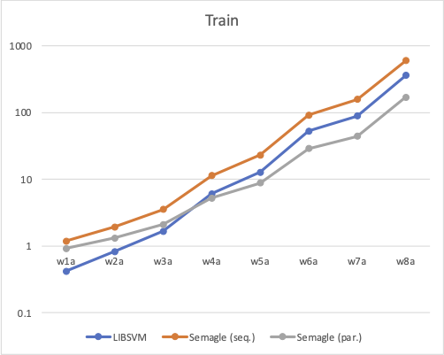
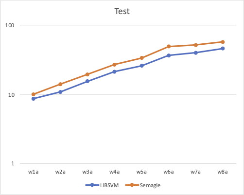

# Performance

Speed is one of the main concerns of machine learning algorithms developers. The native SVM
implementation (LIBSVM 3.25) is optimized for specific kernel types and demonstrates good training and test times for small and large problems. The F# implementation running on Net 5.0 runtime is 1.5 times slower for small problems but is only 10% slower for large problems. However, with parallel kernel evaluations, the F# implementation becomes faster after 5,000 training samples.

## MacOS X

 * **Computer**: MacBook Pro (Model A1990)
 * **Processor**: 2.6 GHz 6-Core Intel Core i7
 * **Memory**: 16 GB 2400 MHz DDR4
 * **Operating System**: macOS Monterey (12.1)
 * **.NET Framework**: Net 5.0.404

### Adult Dataset
* Features: 123
* Kernel: RBF $\gamma=1$
* Cost: C=1

 <table cellpadding="5">
    <thead>
        <tr>
            <th rowspan="3">Dataset</th>
        </tr>
        <tr>
            <th colspan="4">LIBSVM 3.25</th>
            <th colspan="5">Semagle</th>
        </tr>
        <tr>
            <!-- LIBSVM -->
            <th>#SV</th>
            <th>Train</th>
            <th>Test</th>
            <th>Accuracy</th>
            <!-- Semagle -->
            <th>#SV</th>
            <th>Train (seq.)</th>
            <th>Train (par.)</th>
            <th>Test</th>
            <th>Accuracy</th>
        </tr>
    </thead>
    <tbody>
        <tr>
            <td>a1a (1,605/30,956)</td>
            <!-- LIBSVM -->
            <td>1584</td>
            <td>0.27</td>
            <td>4.41</td>
            <td>76.29%</td>
            <!-- Semagle -->
            <td>1584</td>
            <td>0.64</td>
            <td>0.60</td>
            <td>4.23</td>
            <td>76.29%</td>
        </tr>
        <tr>
            <td>a2a (2,265/30,296)</td>
            <!-- LIBSVM -->
            <td>2233</td>
            <td>0.54</td>
            <td>6.39</td>
            <td>76.52%</td>
            <!-- Semagle -->
            <td>2228</td>
            <td>1.26</td>
            <td>0.87</td>
            <td>6.33</td>
            <td>76.53%</td>
        </tr>
        <tr>
            <td>a3a (3,185/29,376)</td>
            <!-- LIBSVM -->
            <td>3103</td>
            <td>1.12</td>
            <td>8.28</td>
            <td>76.73%</td>
            <!-- Semagle -->
            <td>3099</td>
            <td>1.85</td>
            <td>1.42</td>
            <td>8.40</td>
            <td>76.73%</td>
        </tr>
        <tr>
            <td>a4a (4,781/27,780)</td>
            <!-- LIBSVM -->
            <td>4595</td>
            <td>2.39</td>
            <td>11.26</td>
            <td>77.73%</td>
            <!-- Semagle -->
            <td>4587</td>
            <td>3.83</td>
            <td>2.71</td>
            <td>11.32</td>
            <td>77.73%</td>
        </tr>
        <tr>
            <td>a5a (6,414/26,147)</td>
            <!-- LIBSVM -->
            <td>6072</td>
            <td>7.23</td>
            <td>14.03</td>
            <td>77.89%</td>
            <!-- Semagle -->
            <td>6067</td>
            <td>10.29</td>
            <td>5.88</td>
            <td>14.32</td>
            <td>77.89%</td>
        </tr>
        <tr>
            <td>a6a (11,220/21,341)</td>
            <!-- LIBSVM -->
            <td>10235</td>
            <td>33.76</td>
            <td>18.68</td>
            <td>78.53%</td>
            <!-- Semagle -->
            <td>10233</td>
            <td>39.363</td>
            <td>17.72</td>
            <td>20.05</td>
            <td>78.53%</td>
        </tr>
        <tr>
            <td>a7a (16,100/16,461)</td>
            <!-- LIBSVM -->
            <td>14275</td>
            <td>69.33</td>
            <td>21.00</td>
            <td>79.66%</td>
            <!-- Semagle -->
            <td>14266</td>
            <td>78.55</td>
            <td>30.79</td>
            <td>21.85</td>
            <td>79.66%</td>
        </tr>
        <tr>
            <td>a8a (22,696/9,865)</td>
            <!-- LIBSVM -->
            <td>19487</td>
            <td>137.19</td>
            <td>17.23</td>
            <td>80.31%</td>
            <!-- Semagle -->
            <td>19488</td>
            <td>147.98</td>
            <td>60.10</td>
            <td>17.90</td>
            <td>80.31%</td>
        </tr>
        <tr>
            <td>a9a (32,561/16,281)</td>
            <!-- LIBSVM -->
            <td>26947</td>
            <td>233.00</td>
            <td>30.24</td>
            <td>80.77%</td>
            <!-- Semagle -->
            <td>26947</td>
            <td>255.97</td>
            <td>93.01</td>
            <td>37.11</td>
            <td>80.769%</td>
        </tr>
    </tbody>
 </table>

### Web Dataset
* Features: 300
* Kernel: RBF $\gamma=1$
* Cost: C=1

 <table cellpadding="5">
    <thead>
        <tr>
            <th rowspan="3">Dataset</th>
        </tr>
        <tr>
            <th colspan="4">LIBSVM 3.25</th>
            <th colspan="5">Semagle</th>
        </tr>
        <tr>
            <!-- LIBSVM -->
            <th>#SV</th>
            <th>Train</th>
            <th>Test</th>
            <th>Accuracy</th>
            <!-- Semagle -->
            <th>#SV</th>
            <th>Train (seq.)</th>
            <th>Train (par.)</th>
            <th>Test</th>
            <th>Accuracy</th>
        </tr>
    </thead>
    <tbody>
        <tr>
            <td>w1a (2,477/47,272)</td>
            <!-- LIBSVM -->
            <td>2080</td>
            <td>0.42</td>
            <td>8.66</td>
            <td>97.30%</td>
            <!-- Semagle -->
            <td>2080</td>
            <td>1.19</td>
            <td>0.92</td>
            <td>10.02</td>
            <td>97.30%</td>
        </tr>
        <tr>
            <td>w2a (3,470/46,279)</td>
            <!-- LIBSVM -->
            <td>2892</td>
            <td>0.83</td>
            <td>10.87</td>
            <td>97.35%</td>
            <!-- Semagle -->
            <td>2892</td>
            <td>1.93</td>
            <td>1.32</td>
            <td>14.03</td>
            <td>97.35%</td>
        </tr>
        <tr>
            <td>w3a (4,912/44,837)</td>
            <!-- LIBSVM -->
            <td>4018</td>
            <td>1.66</td>
            <td>15.46</td>
            <td>97.37%</td>
            <!-- Semagle -->
            <td>4018</td>
            <td>3.52</td>
            <td>2.10</td>
            <td>19.49</td>
            <td>97.37%</td>
        </tr>
        <tr>
            <td>w4a (7,366/42,383)</td>
            <!-- LIBSVM -->
            <td>5886</td>
            <td>6.06</td>
            <td> 21.26</td>
            <td>97.43%</td>
            <!-- Semagle -->
            <td>5886</td>
            <td>11.3</td>
            <td>5.25</td>
            <td>26.96</td>
            <td>97.43%</td>
        </tr>
        <tr>
            <td>w5a (9,888/39,861)</td>
            <!-- LIBSVM -->
            <td>7715</td>
            <td>12.70</td>
            <td>25.94</td>
            <td>97.45%</td>
            <!-- Semagle -->
            <td>7715</td>
            <td>23.21</td>
            <td>8.83</td>
            <td>33.63</td>
            <td>97.45%</td>
        </tr>
        <tr>
            <td>w6a (17,188/32,561)</td>
            <!-- LIBSVM -->
            <td>12864</td>
            <td>52.72</td>
            <td>36.51</td>
            <td>97.60%</td>
            <!-- Semagle -->
            <td>12864</td>
            <td>92.17</td>
            <td>28.85</td>
            <td>49.22</td>
            <td>97.60%</td>
        </tr>
        <tr>
            <td>w7a (24,692/25,057)</td>
            <!-- LIBSVM -->
            <td>17786</td>
            <td>88.66</td>
            <td>39.91</td>
            <td>97.61%</td>
            <!-- Semagle -->
            <td>17786</td>
            <td>158.37</td>
            <td>44.35</td>
            <td>51.75</td>
            <td>97.61%</td>
        </tr>
        <tr>
            <td>w8a (49,749/14,951)</td>
            <!-- LIBSVM -->
            <td>32705</td>
            <td>359.47</td>
            <td>46.01</td>
            <td>99.39%</td>
            <!-- Semagle -->
            <td>32705</td>
            <td>596.78</td>
            <td>169.33</td>
            <td>57.29</td>
            <td>99.39%</td>
        </tr>
    </tbody>
 </table>
